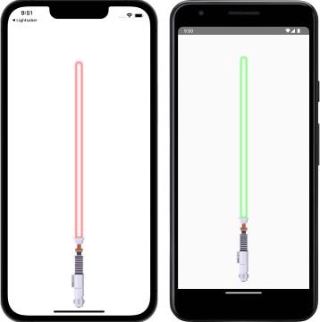

# Compose Lightsaber

A toy Lightsaber app built for my kids with [Compose Multiplatform](https://github.com/JetBrains/compose-multiplatform) 
and [Circuit](https://slackhq.github.io/circuit/).



## Acknowledgements

* Although I created the app icon myself, I referenced this [icon](https://www.flaticon.com/free-icon/lightsaber_2034751?related_id=2034798&origin=search)
* [The Lightsaber handle](https://www.vecteezy.com/vector-art/21470944-lightsaber-flat-illustration-clean-icon-design-element-on-isolated-white-background)
* [Lightsaber Sound Effects](https://www.youtube.com/watch?v=lnc0K4YyMVo)

## References 

* [Compose Multiplatform on iOS](https://www.youtube.com/watch?v=FWVi4aV36d8&list=PLlFc5cFwUnmwcJ7ZXyMmS70A9QFyUu1HI&index=2)
* [Modern Compose Architecture with Circuit](https://www.youtube.com/watch?v=ZIr_uuN8FEw&list=PLlFc5cFwUnmwcJ7ZXyMmS70A9QFyUu1HI&index=10)
* [Architecture at Scale](https://www.droidcon.com/2022/09/29/architecture-at-scale/)
* [Molecule: Using Compose for Presentation Logic](https://www.youtube.com/watch?v=q9p4ewk-9E4)
* [Introduction to drawing in Compose](https://www.youtube.com/watch?v=1yiuxWK74vI)
* [Navigation and Dependency Injection in Compose](https://www.droidcon.com/2022/09/29/navigation-and-dependency-injection-in-compose/)

## License

```
Copyright Aaron Alaniz 

Licensed under the Apache License, Version 2.0 (the "License");
you may not use this file except in compliance with the License.
You may obtain a copy of the License at

    https://www.apache.org/licenses/LICENSE-2.0

Unless required by applicable law or agreed to in writing, software
distributed under the License is distributed on an "AS IS" BASIS,
WITHOUT WARRANTIES OR CONDITIONS OF ANY KIND, either express or implied.
See the License for the specific language governing permissions and
limitations under the License.
```
